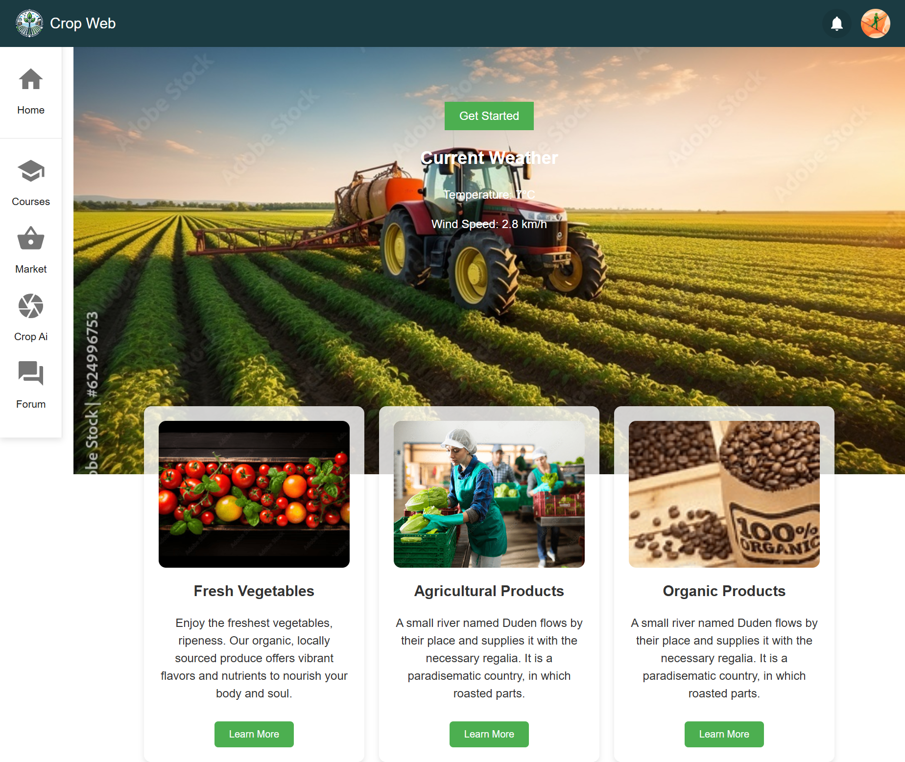
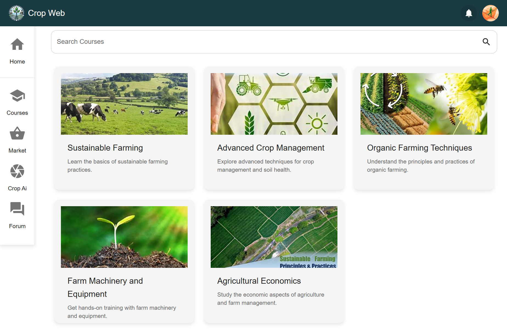
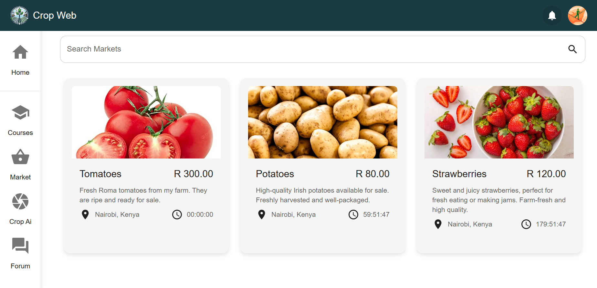
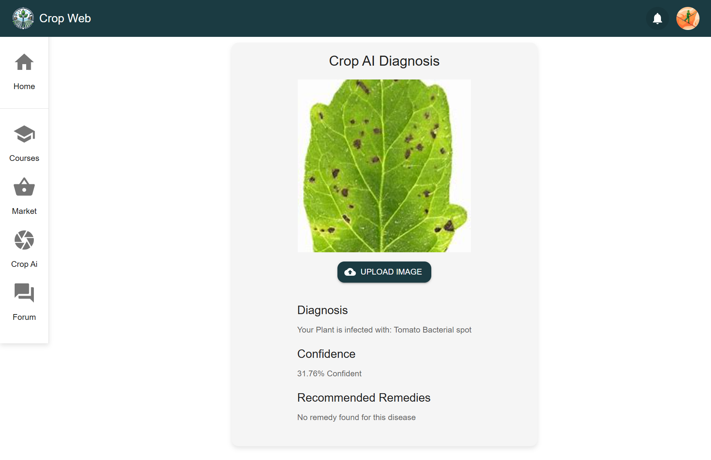
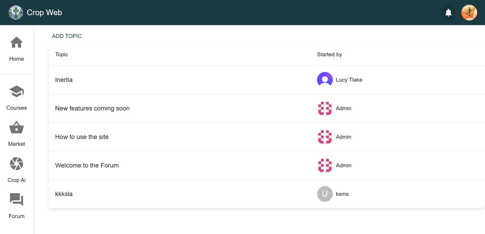

# Crop Web

Crop Web is a comprehensive web application designed to support and educate farmers. It offers a variety of resources, including educational courses, a marketplace for selling produce, AI-powered image analysis for disease diagnosis, and a discussion forum for community engagement.

## Features

- **Educational Courses:** Access a wide range of courses to enhance farming knowledge and skills.
- **Marketplace:** Buy and sell produce within a community-driven marketplace.
- **AI Analysis:** Upload images for AI-powered analysis to diagnose crop diseases.
- **Discussion Forum:** Engage with other farmers, ask questions, and share insights in the community forum.

## Screenshots

1. **Home Page**

   

2. **Courses**

   

3. **Marketplace**

   

4. **AI Analysis**

   

5. **Discussion Forum**

   

## Installation

1. Clone the repository:
   ```bash
   git clone https://github.com/TheNumbered/crop-web.git

## Installation
To install the project, follow these steps:
1. Clone the repository.
2. Navigate to the `frontend` directory and run `pnpm install` to install frontend dependencies.
3. Navigate to the `backend` directory and run `pnpm install` to install backend dependencies.

## Usage
To run the project, use the following scripts:
- `pnpm frontend`: Runs the frontend development server.
- `pnpm backend`: Runs the backend development server.
- `pnpm install`: Installs frontend and backend dependencies.

## Database Management
To manage your database (dump or restore), you can use the following commands in the backend directory:
- `cd backend`: Make sure you're in the backend directory for the following to work

### Dump the database:
- `pnpm db dump local`: This command will generate a SQL dump file and automatically create TypeScript interfaces based on the dumped database schema. (requires .env.local)
- `pnpm db dump server`: This does the same as the above but with the server database (requires .env.server)

### Restore the database:
- `pnpm db restore local`: This command will restore the local database from a SQL dump file.
- `pnpm db restore server`: This command will restore the server database from a SQL dump file.

## Technologies Used
- Frontend: React, React Router, Material-UI, Emotion, TensorFlow.js
- Backend: Express, MySQL, Clerk SDK, CORS, Dotenv

## Environment Variables

### Backend Environment Variables
Create a `.env.local` file in the `backend` directory with the following variables:


- `MYSQL_HOST`: The hostname of your MySQL database server.
- `MYSQL_USER`: The username to access your MySQL database.
- `MYSQL_PASSWORD`: The password to access your MySQL database.
- `MYSQL_DATABASE`: The name of your MySQL database.
- `MYSQL_PORT`: The port number on which your MySQL database is running.
- `CLERK_SECRET_KEY`: The secret key for Clerk authentication.

### Frontend Environment Variables
Create a `.env.local` file in the `frontend` directory with the following variables:

- `VITE_CLERK_PUBLISHABLE_KEY`: The publishable key for Clerk authentication.
- `VITE_API_URL`: The URL for the backend API.


## Acknowledgments
This project was developed to support the farming community by providing education, resources, and a platform for collaboration, This project was developed by the team of:
Daniel Ngobe, Sisekelo Ngcobo, Theophilus Kgopa and Blessings